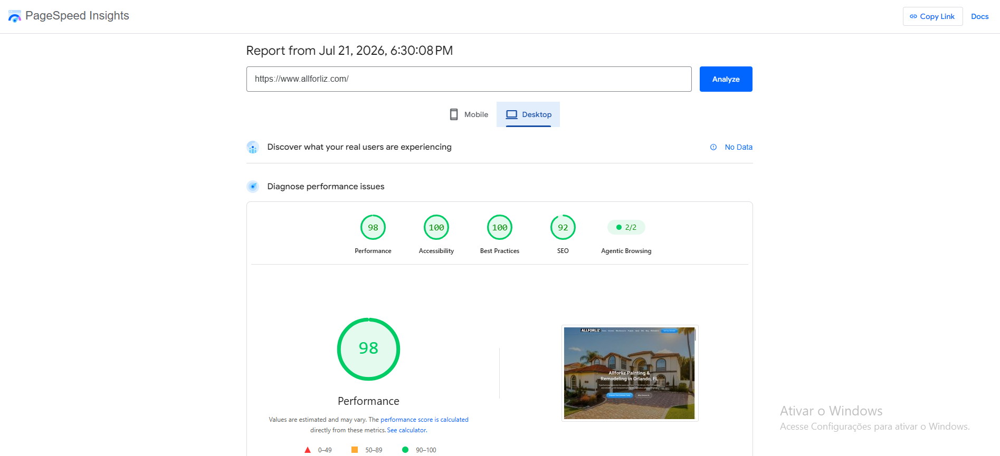

# Allforliz Website Optimization

Technical case study of website performance optimization, local SEO, content architecture, lead generation and system integrations for Allforliz Painting and Renovations.

## About the Project

This repository documents the work performed to improve, expand and integrate the existing Allforliz website.

The original website was not developed by me. My role was to optimize, restructure and maintain the website, focusing on performance, search visibility, user experience, lead generation and integration with the company's internal systems.

Allforliz Painting and Renovations is a painting and remodeling company serving Clermont, Orlando and surrounding areas in Central Florida.

## Main Activities

- Website performance optimization
- Image optimization and replacement
- Creation and improvement of service pages
- Local SEO implementation
- Blog creation and publication
- Page indexing and monitoring
- Internal link organization
- Elfsight form integration
- n8n workflow integration
- Get Your Free Estimate form creation
- Work With Us form creation
- AI-powered bilingual lead chatbot implementation
- Integration between the website, n8n, OpenAI and Notion

## Key Results

### Desktop PageSpeed Results

- Performance: 98
- Accessibility: 100
- Best Practices: 100
- SEO: 92
- Agentic Browsing: 2/2

### Mobile PageSpeed Results

- Performance: 86
- Accessibility: 100
- Best Practices: 100
- SEO: 92
- Agentic Browsing: 2/2

During the optimization process, an accessibility issue involving the website's social media icons was identified and corrected.

After the correction:

- Accessibility increased from 99 to 100
- Agentic Browsing increased from 1/2 to 2/2
- Desktop Performance increased from 96 to 98

## Tools and Technologies

- Webflow
- Google PageSpeed Insights
- Google Search Console
- Google Business Profile
- Elfsight
- n8n
- Notion
- OpenAI
- Webhooks
- HTML and CSS concepts
- Prompt engineering
- Natural language processing
- SEO tools
- Image optimization tools

## Key Features

- Service-specific website pages
- Local SEO-focused content
- Responsive customer forms
- Automated form submission processing
- AI-powered bilingual chatbot
- English and Portuguese conversation support
- Natural lead information collection
- Context-aware follow-up questions
- Integration between website forms, n8n and Notion
- Automated lead organization

## Website Services Documented

The website includes dedicated pages for:

- Interior Painting
- Exterior Painting
- Roof Painting
- Cabinet Painting
- Flooring Installation and Replacement
- Fireplace Remodeling and Built-Ins
- Kitchen Remodeling
- Bathroom Remodeling
- Full Home Remodeling

## Project Documentation

- [Project Overview](docs/project-overview.md)
- [Performance Optimization](docs/performance-optimization.md)
- [Local SEO Strategy](docs/seo-strategy.md)
- [Service Pages](docs/service-pages.md)
- [Website Integrations](docs/integrations.md)

## Project Evidence

- [PageSpeed Results](assets/performance/)
- [Service Page Screenshots](assets/screenshots/service-pages/)
- [Blog Screenshots](assets/screenshots/blog/)
- [Website Forms](assets/screenshots/forms/)
- [AI Bilingual Lead Chatbot](assets/screenshots/chatbot/)
- [Technical Diagrams](assets/diagrams/)

## AI-Powered Bilingual Chatbot

The website includes a chatbot powered by OpenAI.

The chatbot was designed to:

- Understand natural language
- Communicate in English and Portuguese
- Maintain conversation context
- Collect lead information
- Ask additional questions when information is incomplete
- Adapt the conversation according to the visitor's needs
- Send structured information to the company's internal workflow

This integration connects the website experience with the company's lead management process.

## Website Forms

Two main forms were created and integrated into the website:

### Get Your Free Estimate

Designed for potential customers interested in painting and remodeling services.

The form collects:

- Contact information
- Requested service
- Project description
- Project location
- Budget range
- Preferred timeline
- Project photos
- Contact preference

### Work With Us

Designed for workers, subcontractors and service providers interested in working with the company.

The form collects:

- Personal information
- Contact information
- Professional experience
- Area of expertise
- Vehicle and equipment availability
- Additional application information

Both forms were created using Elfsight and connected to n8n workflows through webhooks.

## Project Status

The initial version of this technical case study is complete.

The repository currently includes:

- Technical documentation
- PageSpeed results
- Service page screenshots
- Blog evidence
- Website form screenshots
- Integration documentation
- AI chatbot documentation
- Technical architecture diagrams

Additional evidence and improvements may be added as the website continues to evolve.

## Skills Demonstrated

- Website performance optimization
- Technical SEO
- Local SEO
- Content architecture
- User experience
- Website maintenance
- Systems integration
- Workflow automation
- Webhooks
- Artificial intelligence integration
- Prompt engineering
- Data collection and transformation
- Requirements analysis
- Testing and debugging
- Continuous improvement

## Privacy

This repository does not include:

- Customer information
- Applicant information
- Passwords
- API keys
- OpenAI credentials
- Webhook URLs
- Access tokens
- Internal database identifiers
- Confidential company data

All examples and screenshots use public, fictional or anonymized information.

## Disclaimer

The original Allforliz website was not developed by me.

This repository documents the optimization, restructuring, content development, SEO implementation, chatbot development and systems integration work performed by me on the existing website.
