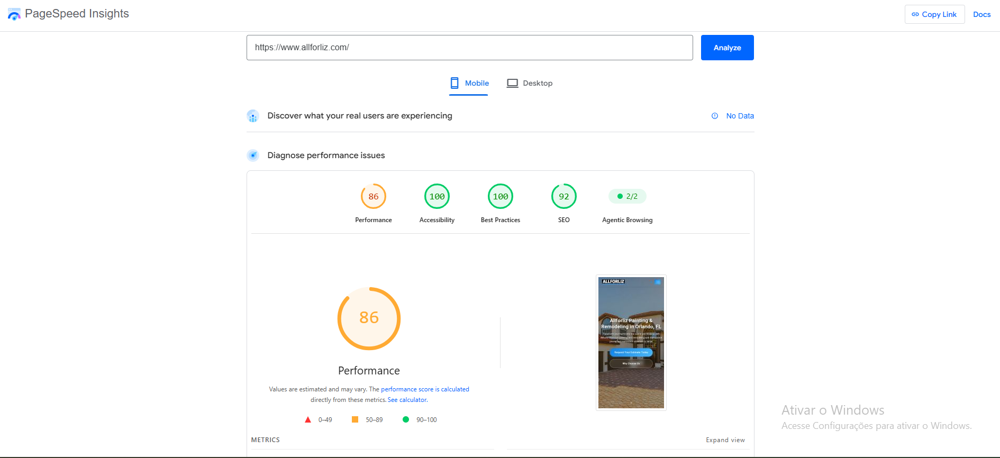

# Performance Evidence

This folder contains evidence related to the website performance optimization work performed on the Allforliz website.

## Latest PageSpeed Insights Results

The website was tested using Google PageSpeed Insights on July 21, 2026.

### Desktop Results

- Performance: 98
- Accessibility: 100
- Best Practices: 100
- SEO: 92
- Agentic Browsing: 2/2


### Mobile Results

- Performance: 86
- Accessibility: 100
- Best Practices: 100
- SEO: 92
- Agentic Browsing: 2/2



## Accessibility Improvement

During testing, an accessibility issue was identified in the footer social media icons.

The image element contained an `aria-label` while also being treated as a decorative image with an empty alternative text.

The issue was corrected by moving the accessible label from the image element to the parent link element.

Before:

```html

```

After:

```html
<a href="#" aria-label="Visit Allforliz on Instagram">
  
</a>
```

After this correction:

- Accessibility increased from 99 to 100
- Agentic Browsing increased from 1/2 to 2/2
- Desktop Performance increased from 96 to 98

## Optimization Work

The performance optimization process included:

- Image compression
- Image dimension adjustments
- Removal of unnecessary visual elements
- Mobile layout review
- Page structure improvements
- Accessibility corrections
- Repeated PageSpeed testing
- Technical issue identification and correction

## Privacy

Only public and non-confidential website information is included in this folder.

No customer information, credentials, API keys, webhook URLs or private company data are published.
