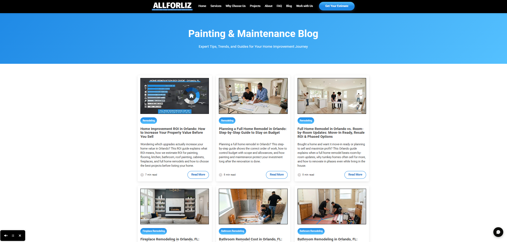
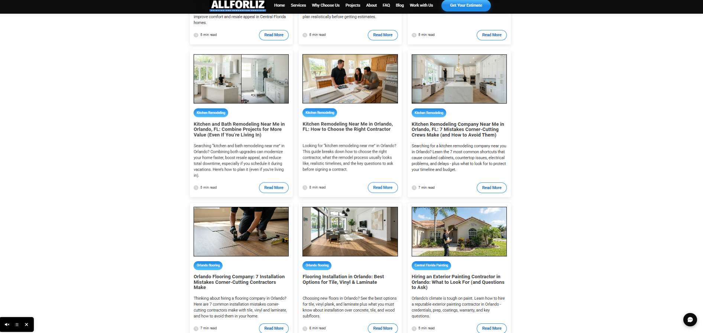

# Blog Screenshots

This folder contains screenshots of blog articles created and published as part of the Allforliz website content and local SEO strategy.

The blog content was designed to:

- Support the main service pages
- Answer common customer questions
- Improve internal linking
- Increase the number of indexable pages
- Strengthen local SEO
- Attract visitors searching for painting and remodeling services
- Direct readers to relevant service pages and estimate request forms

## Content Topics

The blog articles cover topics such as:

- Interior painting
- Exterior painting
- Kitchen remodeling
- Bathroom remodeling
- Flooring installation
- Cabinet painting
- Surface preparation
- Home renovation
- Project planning
- Local service information

## SEO Structure

The blog posts were organized to include:

- Clear page titles
- Relevant service keywords
- Local search terms
- Educational content
- Internal links
- Calls to action
- Links to service pages
- Links to estimate request forms

## Local SEO Focus

The content strategy included locations such as:

- Clermont
- Orlando
- Winter Garden
- Lake Mary
- Longwood
- Sanford
- Ocala
- Port Orange
- Central Florida

Location references were used naturally according to the service, completed project or target audience of each article.

## Publishing Process

The blog creation and publishing process included:

1. Identifying a relevant topic
2. Reviewing common customer questions
3. Selecting service and location keywords
4. Structuring the article
5. Writing and editing the content
6. Adding project images
7. Creating internal links
8. Adding calls to action
9. Publishing the page
10. Requesting indexing through Google Search Console

## Screenshots

Screenshots of selected blog articles will be added to this folder.

Each screenshot will demonstrate elements such as:

- Article title
- Content organization
- Local SEO targeting
- Internal linking
- Calls to action
- Service-related content
- Website layout

## Privacy

All screenshots contain public website information only.

This folder does not include:

- Customer information
- Private form submissions
- Internal credentials
- API keys
- Webhook URLs
- Confidential company data

## Blog Page Overview

The screenshots below show the main blog page and the organization of its articles.

The blog includes:

- Service-based content categories
- Local SEO-focused titles
- Article summaries
- Estimated reading time
- Read More buttons
- Painting, remodeling and flooring topics
- Internal navigation to individual articles

### Top Section

### Article Categories and Content

