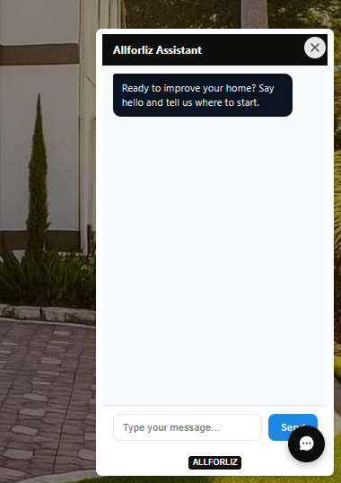

# # Allforliz AI Bilingual Lead Chatbot

This folder documents an AI-powered customer service chatbot developed and integrated into the Allforliz website.

The chatbot uses OpenAI to conduct natural conversations with website visitors, identify their needs and collect the information required by the company.

It can communicate in both English and Portuguese and continue the conversation dynamically when additional questions or clarification are needed.

## Objective

The main objectives of the chatbot are:

- Provide an intelligent customer contact channel
- Assist visitors outside regular business hours
- Collect lead information automatically
- Understand the customer's project needs
- Ask follow-up questions when information is incomplete
- Support conversations in English and Portuguese
- Reduce manual work during the initial customer contact
- Direct qualified information into the company's lead management process

## AI Integration

The chatbot uses OpenAI to interpret customer messages and generate context-aware responses.

Unlike a fixed question-and-answer flow, the chatbot can:

- Understand natural language
- Identify the language used by the visitor
- Respond in English or Portuguese
- Maintain the context of the conversation
- Ask additional questions when necessary
- Adapt its responses according to the customer's request
- Collect structured information through a natural conversation
- Handle questions that do not follow a predefined sequence

## Information Collection

The chatbot was configured to collect relevant lead information, including:

- Customer name
- Phone number
- Email address
- Project location
- Requested service
- Project description
- Preferred timeline
- Additional project details

When the visitor does not provide all the required information, the chatbot continues the conversation and asks relevant follow-up questions.

## Conversation Flow

A simplified chatbot flow is shown below:

```text
Website Visitor
      |
      v
Customer Message
      |
      v
AI Language and Intent Analysis
      |
      v
Context-Aware Response
      |
      v
Required Information Complete?
      |
      |------ No: Ask Follow-Up Question
      |             |
      |             v
      |       Continue Conversation
      |
      |------ Yes: Structure Lead Information
                    |
                    v
             Internal Workflow
                    |
                    v
            Lead Management System
```

## Bilingual Support

The chatbot supports conversations in:

- English
- Portuguese

It identifies the language used by the visitor and continues the interaction in the same language.

This feature helps the company serve both English-speaking and Portuguese-speaking customers in Central Florida.

## Website Integration

The chatbot is embedded into the Allforliz website and available across multiple pages.

It appears as a floating chat button, allowing visitors to begin a conversation without leaving the page they are viewing.

## Internal Workflow Integration

The chatbot is connected to the company's internal automation workflow.

After collecting the required information, the data can be:

- Organized into a structured format
- Validated
- Sent through an automation workflow
- Added to the lead management database
- Used for customer follow-up

## Technologies and Concepts

The chatbot project involved:

- OpenAI
- Artificial intelligence
- Natural language processing
- Prompt engineering
- Bilingual conversation handling
- Context management
- n8n
- Webhooks
- Data validation
- Data transformation
- Notion integration
- Lead management automation
- Website integration

## Main Challenges

The main technical challenges included:

- Defining which information the chatbot needed to collect
- Creating instructions for natural conversations
- Preventing repetitive questions
- Maintaining conversation context
- Supporting two languages
- Handling incomplete customer responses
- Transforming conversational information into structured data
- Connecting the chatbot to internal workflows
- Mapping the collected information to the lead database

## User Experience

The chatbot was designed to provide:

- Natural conversation
- Clear and professional responses
- Simple interaction
- Bilingual support
- Context-aware follow-up questions
- Mobile and desktop compatibility
- Easy access from different website pages

## Current Status

The chatbot is active on the Allforliz website and connected to the company's internal lead management workflow.

## Screenshot

A screenshot of the chatbot interface will be added below.



## Privacy and Security

The repository will not include:

- OpenAI API keys
- Real customer conversations
- Personal customer information
- Webhook URLs
- Access tokens
- Internal database identifiers
- Private system instructions
- Company credentials

All examples will use fictional or anonymized information.
