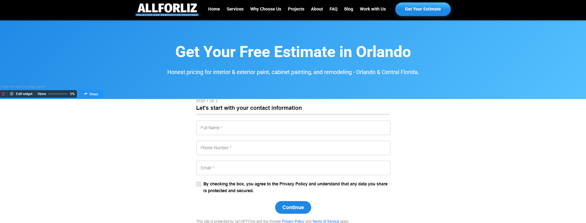
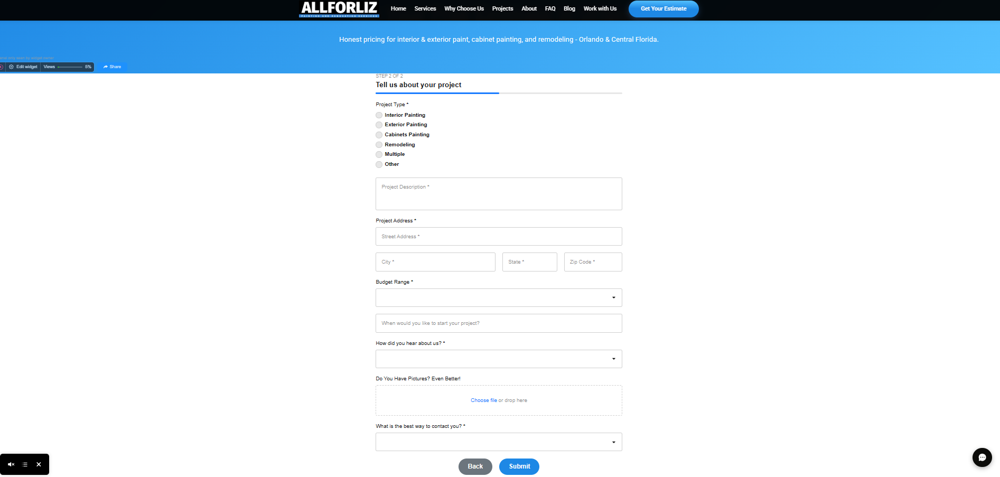

# Website Form Screenshots

This folder contains screenshots of forms created and integrated into the Allforliz website.

The forms were designed to improve data collection, lead generation and communication with potential customers and professionals interested in working with the company.

## Forms Included

The website includes two main forms:

- Get Your Free Estimate
- Work With Us

### Get Your Free Estimate

The screenshots below show the two-step customer estimate request form.

The form includes:

- Full name
- Phone number
- Email address
- Privacy policy agreement
- Project type selection
- Project description
- Project address
- Budget range
- Preferred timeline
- Lead source question
- File upload option for project photos
- Contact preference
- Multi-step navigation
- Embedded responsive layout

#### Step 1



#### Step 2



## Work With Us

The screenshot below shows the form created for workers, subcontractors and professionals interested in working with Allforliz.

The form includes:

- Full name
- Phone number
- Email address
- Area of expertise
- Professional experience
- Availability
- Additional information
- Embedded responsive layout


## Elfsight Integration

The forms were created and embedded into the website using Elfsight.

Elfsight was selected because it provided:

- Responsive form layouts
- Faster form implementation
- Easy website embedding
- Customizable fields
- Integration with external automation tools
- Improved user experience

## Automation Connection

Form submissions are sent to n8n through webhook integrations.

A simplified flow is shown below:

```text
Website Visitor
      |
      v
Elfsight Form
      |
      v
Webhook
      |
      v
n8n Workflow
      |
      v
Data Validation and Processing
      |
      v
Internal Database
```

## Screenshots

Screenshots of the forms will be added below.

### Get Your Free Estimate

Screenshot pending.

### Work With Us

Screenshot pending.

## Privacy

Only empty forms or forms containing fictional information will be included.

The screenshots will not contain:

- Real customer names
- Phone numbers
- Email addresses
- Project addresses
- Applicant information
- Webhook URLs
- API keys
- Internal database identifiers
